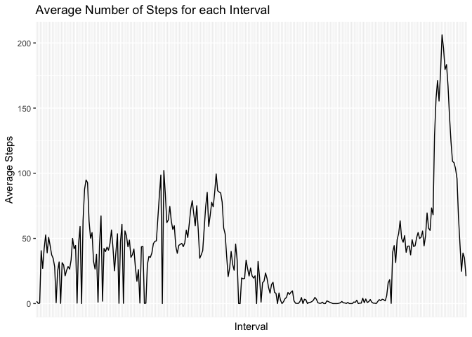
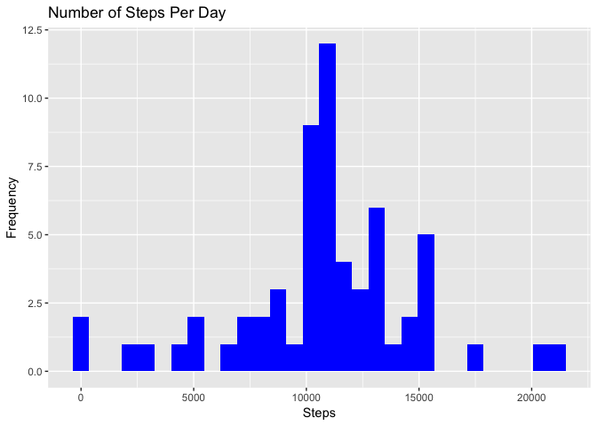
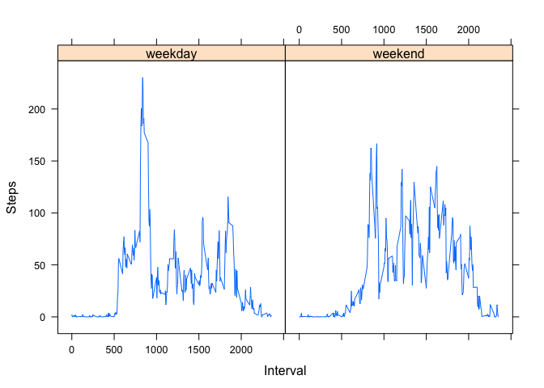

## Loading and preprocessing the data

```r
activity.data <- read.csv("activity.csv")
activity.data$date <- as.Date(activity.data$date)
```


## What is mean total number of steps taken per day?

```r
#create dataframe steps.by.day that contains total steps for each day
steps.by.day <- as.data.frame(with(activity.data, tapply(steps, date, sum, na.rm=TRUE)))
colnames(steps.by.day) <- "Steps"
steps.by.day$Date <- rownames(steps.by.day)
rownames(steps.by.day) <- NULL

#plot histogram with frequency of steps for each day
library(ggplot2)
p1 <- ggplot(data=steps.by.day, mapping=aes(x=Steps))
p1 <- p1 + geom_histogram(fill="blue") + ggtitle("Number of Steps Per Day")
p1 <- p1 + ylab("Frequency")
p1
```

<!-- -->

```r
#print dataframe with mean and median steps per day
steps.mean <- round(mean(steps.by.day$Steps),0)
steps.median <- median(steps.by.day$Steps)
data.frame(Mean_Steps_Per_Day = steps.mean, Median_Steps_Per_Day = steps.median)
```

```
##   Mean_Steps_Per_Day Median_Steps_Per_Day
## 1               9354                10395
```


## What is the average daily activity pattern?

```r
#create dataframe with number of steps for each interval
steps.by.interval <- as.data.frame(with(activity.data, 
                                        tapply(steps, interval, mean, na.rm=TRUE)))
colnames(steps.by.interval) <- "Steps"
steps.by.interval$Interval <- rownames(steps.by.interval)
rownames(steps.by.interval) <- NULL

#plot the time series graph for steps by interval
p2 <- ggplot(steps.by.interval, aes(x=Interval, y=Steps))
p2 <- p2 + geom_line(group=1) + 
  theme(axis.ticks.x = element_blank(), axis.text.x = element_blank()) + 
  labs(y="Average Steps", title="Average Number of Steps for each Interval")
p2
```

<!-- -->

```r
#noquote is used so the message doesn't print with quotes
noquote(paste("Interval with the most steps",
            steps.by.interval[which.max(steps.by.interval$Steps), "Interval"], sep=":  "))
```

```
## [1] Interval with the most steps:  835
```


## Imputing missing values
### Strategy is to give each missing interval the average value for that interval

```r
#print the number of missing values in each column
#only steps has missing values
missing.values <- apply(activity.data, 2, function(x) sum(is.na(x)))
cat("Missing Values in Each Column\n", names(missing.values), "\n", missing.values[1],
    "\t", missing.values[2], "\t", missing.values[3])
```

```
## Missing Values in Each Column
##  steps date interval 
##  2304 	 0 	 0
```

```r
#make dataframe with the average value by interval
mean.by.interval <- as.data.frame(with(activity.data, 
                                       tapply(steps, interval, mean, na.rm=TRUE)))

colnames(mean.by.interval) <- "Steps"
mean.by.interval$Interval <- rownames(mean.by.interval)
rownames(mean.by.interval) <- NULL

#make a copy of the original dataframe
activity.data.no.NA <- activity.data

#if the value is not missing, don't change it
#if the value is missing, use match to find the correct interval from 
#missing.values and return the respective number of steps
activity.data.no.NA$steps <- ifelse(!is.na(activity.data.no.NA$steps),
                                    activity.data.no.NA$steps, 
                                    mean.by.interval$Steps[
                                    match(activity.data.no.NA$interval,
                                    mean.by.interval$Interval)])

#make a dataframe with the average steps by day, after imputing missing values
steps.by.day <- as.data.frame(with(activity.data.no.NA, tapply(steps, date, sum)))
colnames(steps.by.day) <- "Steps"
steps.by.day$Date <- rownames(steps.by.day)
rownames(steps.by.day) <- NULL

#print the new steps by day histogram with the imputed values
p3 <- ggplot(data=steps.by.day, mapping=aes(x=Steps))
p3 <- p3 + geom_histogram(fill="blue") + ggtitle("Number of Steps Per Day")
p3 <- p3 + ylab("Frequency")
p3
```

<!-- -->

```r
#get the new mean and median
steps.mean <- round(mean(steps.by.day$Steps),0)
steps.median <- round(median(steps.by.day$Steps),0)
data.frame(Mean_Steps_Per_Day = steps.mean, Median_Steps_Per_Day = steps.median)
```

```
##   Mean_Steps_Per_Day Median_Steps_Per_Day
## 1              10766                10766
```


## Are there differences in activity patterns between weekdays and weekends?

```r
#set the value of the is.weekend variable
activity.data.no.NA$is.weekend <- ifelse(weekdays(activity.data.no.NA$date) %in%
                                                    c("Saturday", "Sunday"),
                                                    "weekend", "weekday")

#convert is.weekend to a factor
activity.data.no.NA$is.weekend <- factor(activity.data.no.NA$is.weekend, 
                                            levels=c("weekday", "weekend"))

#get the new steps by interval dataframe with the imputed values
#broken down by interval and is.weekend
steps.by.interval <- with(activity.data.no.NA,aggregate(steps, 
                               by=list(interval, is.weekend),
                               FUN=mean))
colnames(steps.by.interval) <- c("Interval", "is.weekend", "Steps")

#plot the mean steps with imputed values by interval
library(lattice)
xyplot(Steps~Interval | is.weekend, data=steps.by.interval, type="l")
```

<!-- -->
